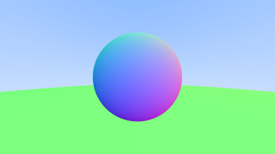
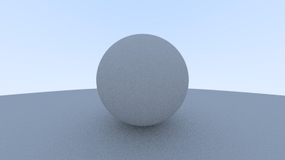
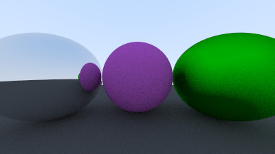
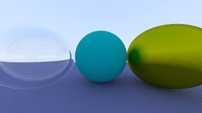
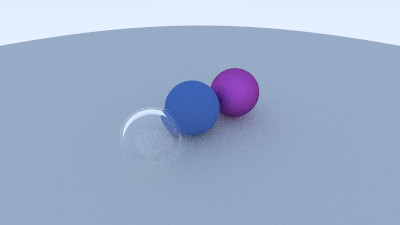
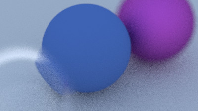
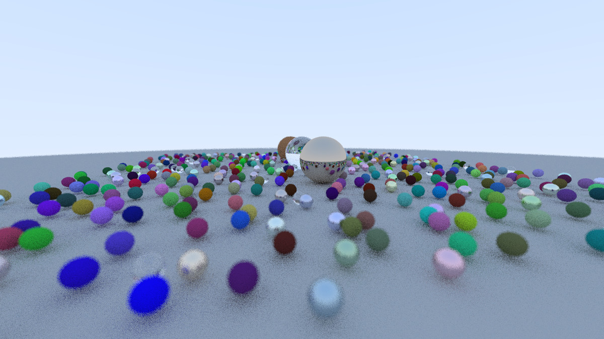

### About

---

This project is a CPU-based ray tracer written entirely in modern C++ using only the standard library. It was developed while working through Peter Shirley's *Ray Tracing in One Weekend* series, with the goal of understanding the mathematical and physical principles behind ray tracing rather than simply reproducing the final images.

Throughout the project I explored how rays can be used to simulate the behavior of light in a virtual environment. Each stage of development introduced a core rendering concept, beginning with basic ray-sphere intersections and gradually expanding into a path tracer capable of producing realistic lighting effects.

- **Vector Mathematics** for ray generation, surface normals, and geometric calculations.
- **Ray-Object Intersections** to determine how rays interact with scene geometry.
- **Diffuse Scattering** using Monte Carlo sampling to simulate indirect lighting.
- **Material Systems** that model how different surfaces absorb, reflect, and transmit light.
- **Metallic Reflection** with adjustable surface roughness.
- **Dielectric Refraction** based on Snell's Law, including total internal reflection and Fresnel effects.
- **Gamma Correction** to account for nonlinear display response.
- **Anti-Aliasing** through stochastic supersampling to reduce jagged edges.
- **Depth of Field** produced by modeling a camera aperture and focal distance.
- **Recursive Path Tracing** where rays bounce through the scene, accumulating light contributions until termination.

While the renderer follows the layout given by the tutorial, the primary focus of this project was building an understanding of the underlying concepts that make ray tracing possible.

Pictures
---

*First sphere rendered in this project. Colors mapped relative to the spheres normal vectors.*

*Introduction of diffuse light scattering using random ray sampling, along with gamma correction to improve perceived brightness.*

*Implementation of a material system supporting multiple surface behaviors within the same scene.*

*Dielectric material demonstrating refraction, reflection, and a hollow glass sphere containing an internal air pocket.*

*Refactoring of the camera system into a reusable component, allowing flexible scene composition and camera positioning.*

*Simulation of a finite camera aperture to produce realistic depth of field effects and focus blur.*

*Large Scene with each sphere containing a randomly assigned material.*
